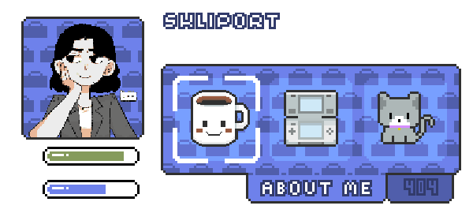
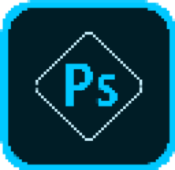

---

    <i>Web Development</i> 
    
    
    
    
    
    
    
    
     <i>Back End Development and DB</i> 
    
    
    
    
    
    
     <i>Engines and IDE's</i> 
    
    
    
    
    
    
     <i>Mobile Development And UX/UI</i> 
    
    
    
    
     <i>Mobile Development And UX/UI</i> 
    
    
    

---

 
    <i>Thanks for passing by</i>  
    <i>Feel free to connect with me</i>  
    <a href="https://www.linkedin.com/in/renecalderondev/)">
    <code></code>

